# Cian's Code Institute Final Grade Calculator - PP2:

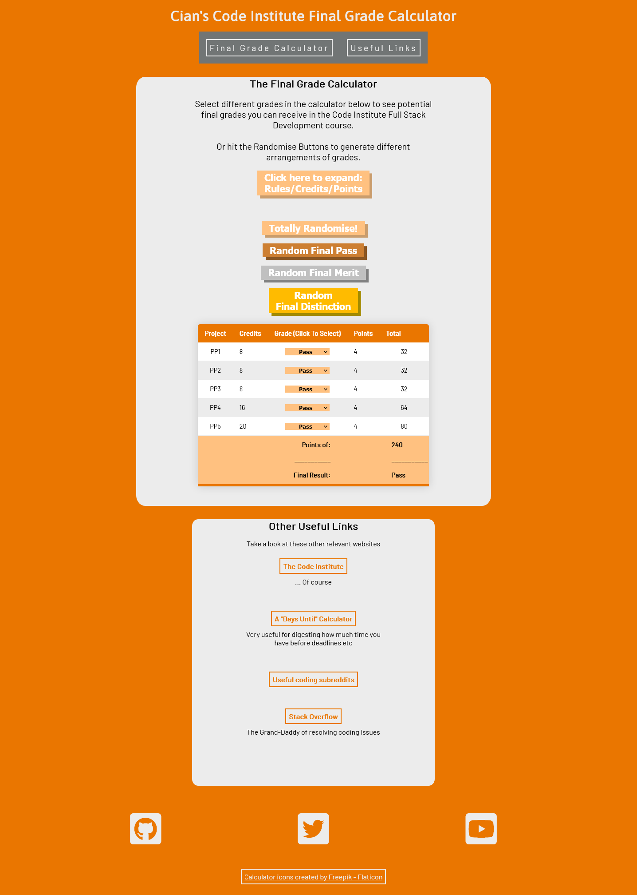

## [Link to live website](https://lastraeus.github.io/pp2-cians-ci-grade-calculator/)

## __Purpose of the Project__
To create a website that allows Code Institute students (studying the Full Stack Development Course) to simulate what final grade they might get by either manually inputting potential project grades, or randomly generating possible grades (In various configurations) to generate a corresponding final grade. 

Additional useful information can be provided to the user such as a breakdown of what each project is worth and links to pre-existing “Days until” calculators(to see the time left before deadlines in a more practical format) and other useful websites.

## __Research__
__Understanding the Target Problem__

The below image is from a snippet of the assessment rules copied from the official assessment guide for the course, found in the Code Institute website learning environment.

Understanding the various components of the final grade calculation and bearing them in mind, allowed me to focus the project on automating the calculation process and allowing rapid simulation of different grade combinations and their final grade outcomes.

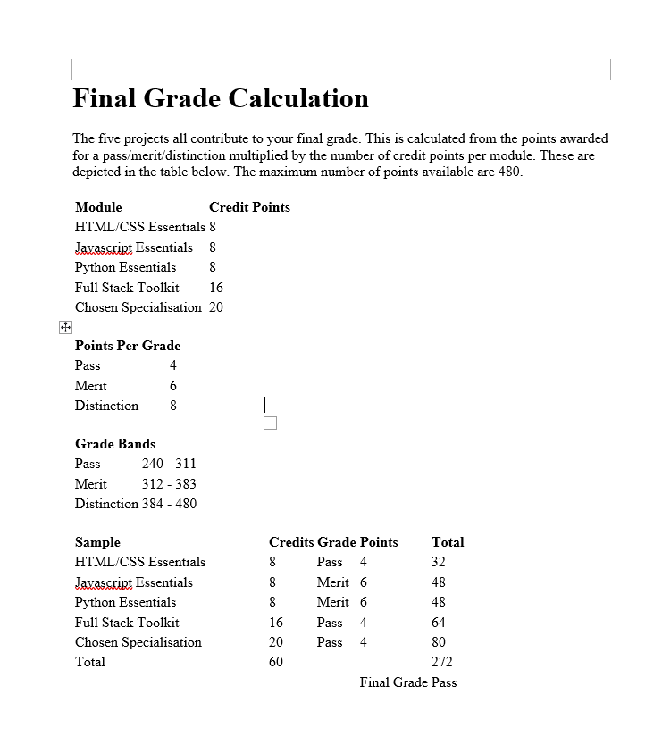

__Audience Needs/Stories__

“It can be difficult to figure out how much each project grade impacts the final grade at the end of the course.”

“I’d love to see a clearer breakdown of how my previous projects have impacted my potential final grade.”

"Having to manually calculate your past grades and potential future ones can be difficult/tedious and time-consuming, especially to repeat for different combinations."

__Search For Similar Sites__

I inspected some websites found on google searches for possible similar projects/solutions I might not have thought of but the calculators I found were suited instead to other types of systems and courses.
* [Link to an inappropriate Final Grade Calculator which is based on both percentages & letter grades](https://www.rapidtables.com/calc/grade/final-grade-calculator.html)

I had an interest in developing additional site functionality non-specific to this course, such as a day's until calculator but this proved to be an exceptionally well-trodden road and I narrowed down the project scope to the unsolved problem of the Code Institute grade calculator, and simply link to an existing "Days until calculator" instead of re-inventing the wheel.

## __Planning__
I initially planned a version of the calculator page for both desktop and mobile sizes as well as a potential secondary page to add the "days until X date" functionality.

  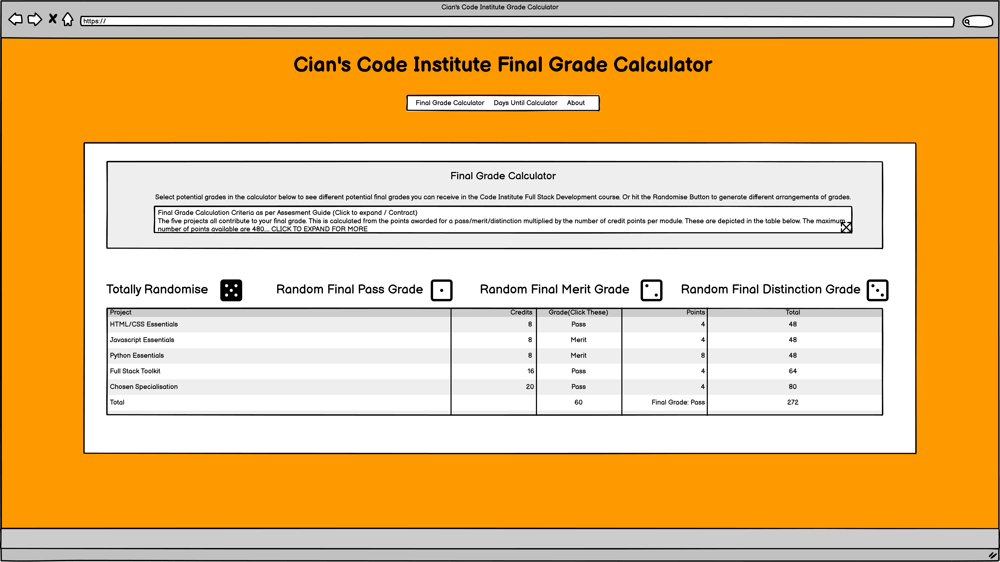

  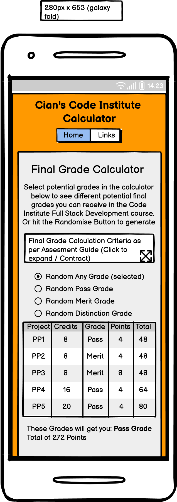

  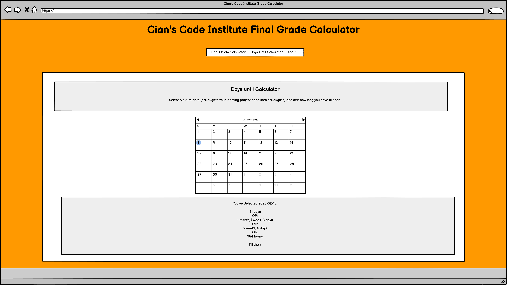

As the project developed the secondary page was decided to be beyond project scope (and was well-trodden functionality available elsewhere to a high standard), and the implementation of the grade table and other elements resulted in a less drastic difference between the layout needed for the mobile size version.

The secondary page was then added instead as a useful links section under the calculator.

### __Color Scheme__
A lighter color scheme was developed for the site featuring orange (the objectively best color!). It featured; a bold orange base background, light grey content boxes, dark grey text, apricot(light orange/beige) for certain highlighting, and white for some large text.

This was used throughout project development as a guide to color styling.

  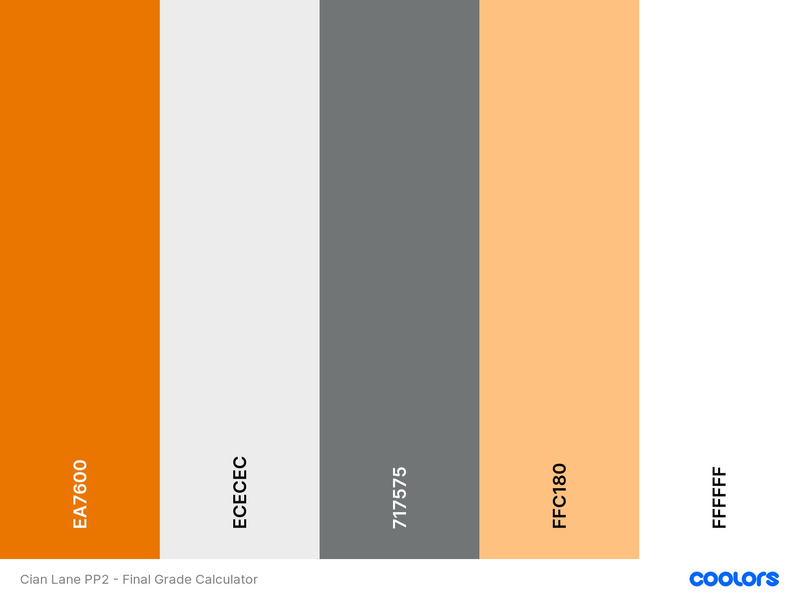

### __Font Choice__
Barlow and Asap were chosen from https://fonts.google.com/ as title and main text fonts, due to their clean solid look.

## __Features__
A single-page website that is responsive down to extremely small screen sizes.

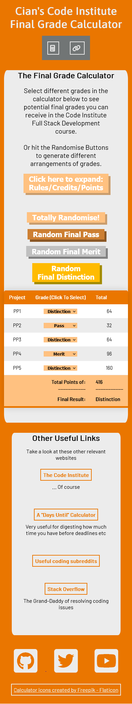

__Featuring:__

__1.__  A Title, Nav Bar, and Intro Blurb for the site.

   *  Responsive main Logo and nav bar. The nav buttons quickly scroll users to relevant sections which may be offscreen and facilitates bookmarking.
   * Nav buttons include hover highlighting for UX/aesthetic considerations. 
   * Logo line spacing shrinks as well as nav buttons change from text to icons at smaller sizes.

  
  

  

  * A blurb featuring information about the calculator’s purpose and functionality.

  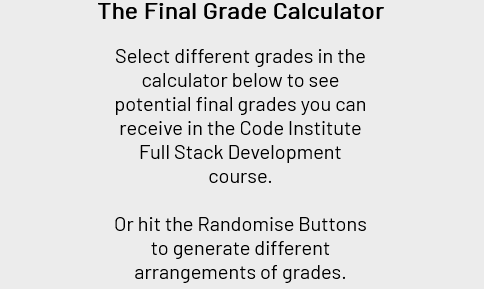

__2.__ An expandable modal opened with a button containing the official calculation weights and rules explanation, used by the calculator, and for general reference. This modal features:

  * A button to open the modal.
  
  
  * Responsive sizing to display all information on all screen sizes.
  * A overlay to focus the user on the newly displayed information and opacity to encourage the user to realize they can click the overlay area to get back to the site behind. (Clicking the overlay closes the modal)
  * A specific "X" to close the modal in its title is the obvious choice for most users of closing the modal.
  * A scroll function built into the modal if the screen size is too small to display all content.

  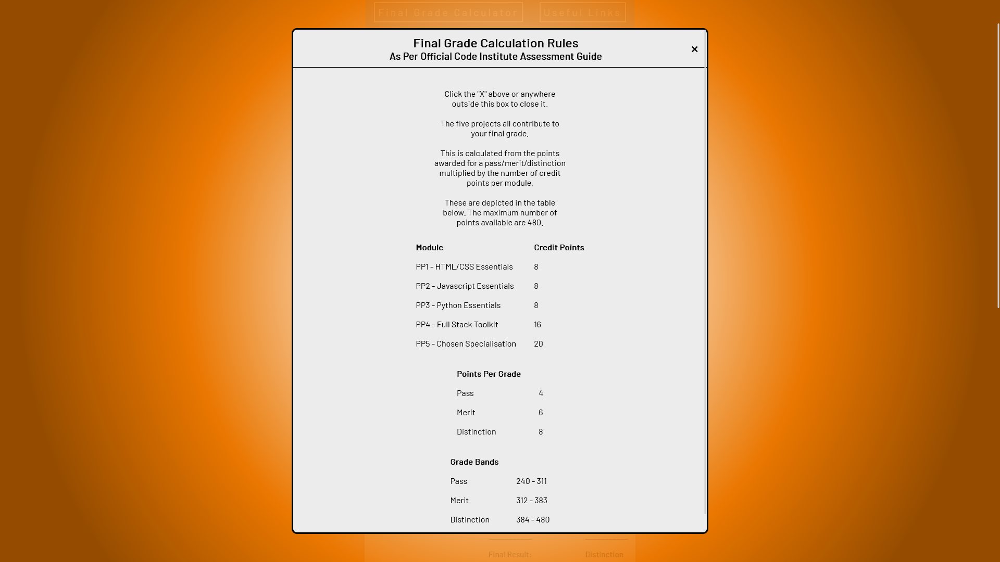
  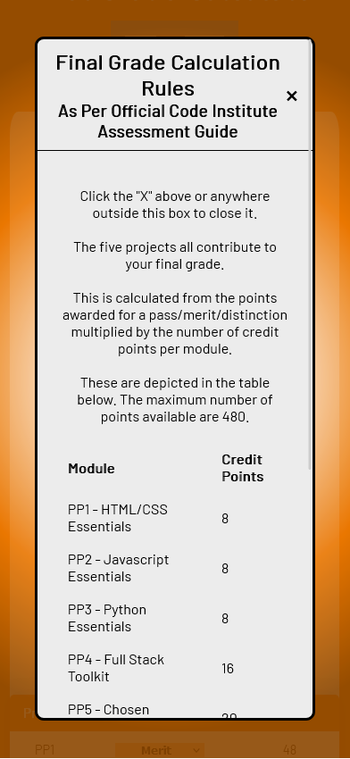
  

__3.__  The Final Grade Calculator itself, with two display modes depending on screen size.

  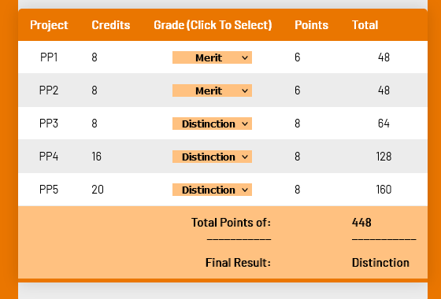
  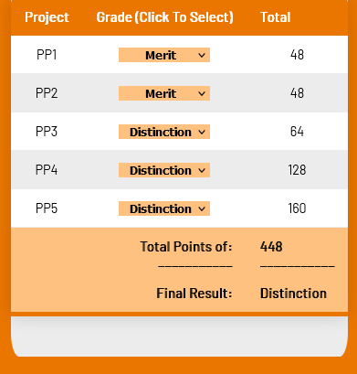

  * Selectable grades for each project, which when changed will live update the total points (on each row, and final total) as well as the displayed Final Result Grade

  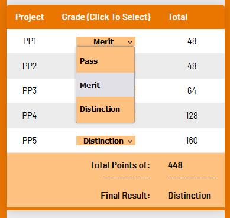

  * Large/Main table mode for large screens with potential grades selectable
  * Truncated table with less padding space and removed least important columns. These are hidden with CSS media queries and classes for narrow screen sizes.

__4.__ The Calculator will also be controllable by 4 different selections of randomisation which will be:
  * Totally random grade selection.
  * Randomly selected results bounded by only combinations that result in a Final Pass Grade.
  * Randomly selected results bounded by only combinations that result in a Final Merit Grade.
  * Randomly selected results bounded by only combinations that result in a Final Distinction Grade.

  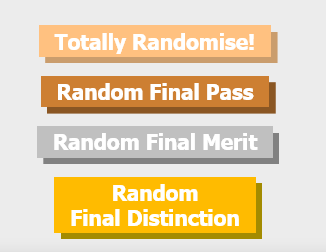

  * These buttons (as well as the above modal button) have been styled with a pleasing 3d effect which seems to press down when clicked.

__5.__ About/Useful Links Page/Contact Form
  * Links to pre-existing "Days Until" calculator (originally planned to be constructed from scratch on this site, but scope creep was reigned-in since this functionality has been done many times before.)
  * Other useful links such as to Code Institute Website / Useful Subreddits etc.
  * All links highlight appropriately when hovered.

    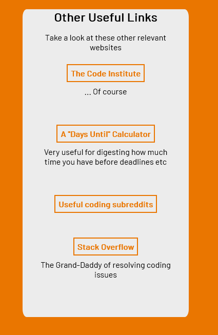

  
__6.__  A footer area at the bottom of the site featuring links to other relevant websites made by this site's creator. Looks clean and unintrusive, but clear when read. These include:

  * A logo link to the project creator's GitHub page.
  * A logo link to the projects' actual Twitter page for any updates that fans of the site may wish to follow.
  * A logo link to the projects' actual Youtube page for any videos that the site creator may make concerning this project (Usage tutorials, other tips, etc) that fans of the site may be interested in.
  * A attribution link is required by the source of the favicon used in the site.

### __Technology Used__

1.  HTML                
Used to build the markup structure of the site.                  
2.  CSS                 
Used to provide both global and targeted styling to the HTML
3.  Javascript          
Used to provide site interactivity.    
4.  GitHub              
Used as a repository for the project                        https://github.com/
5.  GitPod              
Used as the VDE of the project.                             https://www.gitpod.io/
6.  Firefox             
Used as the main browser of the project (Browsing, Editing, Dev Tools, Screenshot capabilities)     https://www.mozilla.org/en-US/firefox/new/
7.  Chrome              
Used as alt browser of the project (Testing, Dev Tools)             https://www.google.com/intl/en_ie/chrome/
8.  Grammarly           
Used to proof this page.                                            https://app.grammarly.com
9.  FontAwesome         
Source of nav icons used in the website.                                https://fontawesome.com/
10. Google Fonts        
Source of fonts used in the site                                    https://fonts.google.com/specimen/Barlow#styles
11. Coolors             
Color Palette Generator used in planning                            https://coolors.co/ea7600-ececec-717575-ffc180-ffffff
12. MSPaint             
For rapid cropping of screenshot images for readme
13. WordCounter         
For assistance staying under 50 chars recommended git commit length   https://wordcounter.net/character-count
14. Chrome Lighthouse Test  
For additional site validation (Accessibility, SEO, etc)
15. Cssgradient         
Used to generate the gradient used as the modal overlay             https://cssgradient.io/
16. Microsoft Edge      
Used as the tertiary testing browser.

### __Possible Future Features to Implement__
Ideas for future possible features include;

__1.__ A page or section to enter your email on the website and have the website email you a formatted version of the currently selected projected grades, for those who want a static saved version for reference. Perhaps this could be outputted instead as a text-based ASCII table in an expandable section/modal, for easy copy-pasting.

__2.__ A homebrew "days until calculator" that allows students to input their upcoming project dates (Potentially all 5 at once) and see the remaining time between and until each project. This information could be displayed in multiple (selectable?) formats.

## __Testing__
### __General Testing Process__
Primary testing through the development process was done via the Gitpod python server command
    python3 -m http.server
to host a browser window of the site. Upon saving changes in gitpod, I would refresh the relevant browser window to see updated changes live. I would make the server public in the gitpod bottom toolbar to test it on foreign browsers (EG chrome, edge)

I would then test to see that changes reflected design intent. (IE check newly added links work, elements are positioned correctly, table calculations tally correctly, buttons work, etc)

Resizing browser with CTRL-SHIFT-M on firefox to see responsive-design-mode. Checked down to sub 280px (Galaxy Fold). Resized in Chrome Dev Tools CTRL-SHIFT-I. Checked down to sub 280px (galaxy fold)
Resized in Edge Dev Tools. Checked down to sub 280px (galaxy fold)

Inspecting any unexpected or hard-to-diagnose bugs with the inspect source feature in firefox/chrome. Tweaking variables with Chrome Dev tools to see changes live and help diagnose the problem.

The result of testing each and every part of the site was deemed satisfactory when the user received:
    - confirmation that the site layout is as the design intended. 
    - confirmation that the site features are fully functional. 
    - confirmation that the site layout adapts as designed dynamically based on the screen size.
    - confirmation that the site content is appropriate to higher organizational goals.

### __Hardware__
This application was tested primarily tested using;
  * my Desktop PC (Windows 10 1440p widescreen monitor) (Firefox & Chrome)
  * My Google Pixel 6a Phone (firefox)

### __Software__

The application was tested with:

Up-to-date Firefox (Windows 10 ver 109.0 Firefox Release January 17, 2023) - Using Dev Tools to inspect all elements of the site, using responsiveness mode to test down to less than 400px emulating Pixel 5 and free responsiveness mode to go to less than 280px wide. Using the console to detect any errors and to diagnose problem variables or states by adding console.log() commands to my javascript scripts when needed.

Up-to-date Chrome (Windows 10 Version 109.0.5414.120 (Official Build) (64-bit)) - Using Dev Tools to inspect all elements of the site, using responsiveness mode to test down to 280px emulating Galaxy fold extremely small screen size and free responsiveness mode to go to less than 280px wide. Occasionally using the console to detect any errors and to diagnose problem variables or states by adding console.log() commands to my javascript scripts when needed.

Up-to-date Edge browser (Windows 10 Version 109.0.1518.61 (Official Build) (64-bit)) - Using responsiveness mode to test down to 280px emulating Galaxy Fold extremely small screen size and free responsiveness mode to go to less than 280px wide.

### __Validator Testing__
No error displaying with w3 HTML validator
https://validator.w3.org/nu/?showsource=yes&doc=https%3A%2F%2Flastraeus.github.io%2Fpp2-cians-ci-grade-calculator%2F

__CSS__
No error was found with https://jigsaw.w3.org/css-validator/#validate_by_input (manual input of style.css content)

__Javascript__
 __https://jshint.com/ JS validator (Manual input of script.js)__

Two warnings were found:
38  Do not use 'new' for side effects.
187 Do not use 'new' for side effects.

These relate to the use of Constructors in a forEach function to add unique click/select listeners to each randomiser button/selector option, to enable the live updating functionality of specific grades. Since these objects just need to be initialized once to complete the unique ID setup process, it was deemed unnecessary by the developer to create a system to save each new instance as a separate variable before passing it to the overarching forEach function in readTableGradeAfterChange() and initializeRandomButtons(). The developer believes this would have led to unnecessary complexity.

 __https://jshint.com/ JS validator (Manual input of modal-script.js)__

 No errors were found.

__Chrome Lighthouse Test__

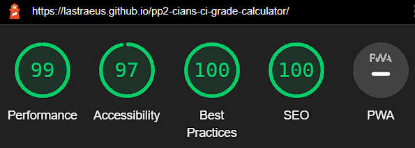

I ran the chrome lighthouse test on the site and received extremely high scores.

### __Bugs Encountered__
 __1.__ 

  When developing the live updating table with grade column selector options, I initially set up the script.js so that a forEach was run on each of the selector elements and would add a listener to each that updated the table values on that row to match the newly selected option. 
  This led to a bug where the same listener was applied to each selector(in each row) simultaneously. After some research I developed an object-orientated part of the system using classes to construct individual objects for each selector based on their unique ID attributes and used that to set up unique listeners within the class, so each specific selector now would only affect the intended row.

  This issue came up again when developing the randomiser buttons, as each needed a unique listener to pass the correct value to the randomiseResults() function. This was solved with the same methodology as above, constructing unique id-attribute-based objects for each that created separate listeners for each button.

 __2.__ 

  When I was adding the (previously freestanding) "Total Points/final results" row to the end of the grade calc table, I encountered a bug where the cell in question where the Total Points/final results were to be inserted was throwing an undefined/adding an "error" code from my function cases instead of the previously functional insert into the previously freestanding results spans.

  I realized then that this was due to the selectors for all values to be calculated being stored as variables that queryselected all available rows for use in calculation arrays.

  I solved this by researching how to limit the querSelectorAll selectors to only look for the first 5 rows(For each project line) leaving the total/final row out of the calculations.  Using the following updated variables;

  let tablePointsNodes = document.querySelectorAll("tr:nth-child(n+1):nth-child(-n+5) td:nth-of-type(4)");
  let tableTotalsNodes = document.querySelectorAll("tr:nth-child(n+1):nth-child(-n+5) td:nth-of-type(5)");

 __3.__ 

  I noticed that despite showing in my gitpod live python3 testing server site, the favicon I added wasn't displaying on Github pages. I found
  [This article](https://sneha-herle.medium.com/favicon-working-on-localhost-but-not-on-github-pages-6c7b9e947504) 
    
  discussing the issue, implemented the suggested line of code into my index.html file, and pushed it to Git Hub. This resolved the issue.

### __Unfixed Bugs__
Other than the above-described jshint.com warnings about my use of new constructors as a "side effect" of a function, which I believed to be justified in these instances, I am not aware of any outstanding bugs.

## __Deployment__
The site was developed using Gitpods Browser Workspace. This was done by:

1. Creating an account with GitHub and creating a GitHub repository with the project name.

2. Navigate to the Gitpod browser extension and install it. I used [the firefox version](https://addons.mozilla.org/en-GB/firefox/addon/gitpod/)

3. Navigate to the project repository and use the new green "gitpod" button to create a workspace based on the repository.

4. Select "more options" and then "open in browser". This will lead you to the workspace after initial loading.

The site was deployed to GitHub pages. The steps to deploy are as follows:

1. In the GitHub repository, navigate to the Settings tab

2. Navigate to the pages tab.

3. Once the master branch has been selected, the page will be automatically refreshed with a detailed ribbon display to indicate the successful deployment. [link to live site](https://lastraeus.github.io/pp2-cians-ci-grade-calculator)

## __Credits__
### __Content__
__Text Content__

Core weighting, rules, project names, etc were directly quoted from the codeinstitute.net Official Assessment Guide for the Full Stack Development Higher Diploma course.

All other main content/blurb text was written by myself.

__Code__

Rohit Sharma - My Code Institute Project Mentor - Numerous valuable insights into formatting, refactoring, commenting tips, and general critique and advice for the project across almost all aspects. His contribution can't be understated and I am extremely lucky to have a mentor who constantly encourages me to improve my fundamentals as a developer. My managing to fully implement barely half of his advice is the reason this project is twice as good as it would have been.

[Switch Statement Reference](https://developer.mozilla.org/en-US/docs/Web/JavaScript/Reference/Statements/switch)

[querySelectorAll usuage](https://youtu.be/D7sNpAiNMQM)

[How I summed the array of total points](https://reqbin.com/code/javascript/m81eb1ms/javascript-sum-array-example)

While learning about reading selectors from various sources (below) I did not find a solution to the problem I was having applying unique listeners to multiple selector inputs. After learning more about selectors in general I concluded that I needed an object-orientated solution to avoid masses of duplicated code for my purposes. This ended up also applying to the randomiser buttons.

[Selector Reference#1](https://stackoverflow.com/questions/10911526/how-do-i-programatically-select-an-html-option-using-javascript)

[Selector Reference#2](https://www.youtube.com/watch?v=kzFJ7St_ma8)

I then combined my understanding of classes and constructors, [helped by this reference video](https://www.youtube.com/watch?v=5AWRivBk0Gw) and trial and error to develop the currently in-use solution.

[Guide to make the 3d buttons used on the site](https://www.youtube.com/watch?v=cWeWnO8XKds)

[First, of Two main guides on Modals I used](https://www.youtube.com/watch?v=MBaw_6cPmAw)

[Second of Two main guides on Modals I used (source of the gradient fill idea)](https://www.youtube.com/watch?v=TAB_v6yBXIE)

[Modal scrolling discussion](https://stackoverflow.com/questions/10476632/how-to-scroll-the-page-when-a-modal-dialog-is-longer-than-the-screen)

[Guide on how to style tables that I leaned on heavily for my grade calc table](https://www.youtube.com/watch?v=biI9OFH6Nmg)

[General Responsiveness Tips 1](https://youtu.be/TUD1AWZVgQ8)

[General Responsiveness Tips 2](https://www.youtube.com/watch?v=VQraviuwbzU)

[General Responsiveness Tips 3](https://youtu.be/VQraviuwbzU)

[nth-child pseudo selector reference](https://stackoverflow.com/questions/15639247/css-selector-for-nth-range)

[Why I changed my input (button) elements to button elements](https://wordpress.org/support/topic/how-do-i-create-2-lines-of-text-on-button/)

__Colors__

[Coolors.co Color Palette Generator](https://coolors.co/ea7600-ececec-717575-ffc180-ffffff)

[Color Palett Inspiration](https://icolorpalette.com/download/palette/443988_color_palette.jpg)

[Gold Silver Bronze color reference (used tweaked value based on this)](https://www.deviantart.com/thewolfbunny64/art/Gold-Silver-and-Bronze-Color-Schemes-649070059)

__Misc syntax reference etc:__

[www.w3schools.com/css](https://www.w3schools.com/css/)

[w3schools.com/html](https://www.w3schools.com/html/)

[www.w3schools.com/jsref/](https://www.w3schools.com/jsref/)

### __Media__

[Source of calculator favicon](https://www.flaticon.com/free-icon/calculator_303635) 
