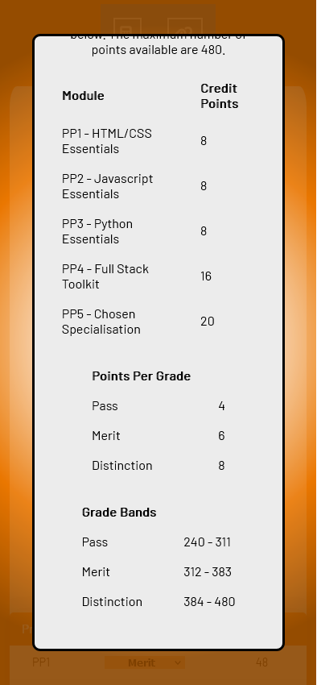

# Cian's Code Institute Final Grade Calculator - PP2:

## [Link to live website](https://lastraeus.github.io/pp2-cians-ci-grade-calculator/)

## __Purpose of the Project__
To create a website that allows Code Institute students (studying the Full Stack Development Course) to simulate what Final Grade they might get by either manually inputting potential Project Grades, or randomly generating possible grades (In various configurations) to generate a corresponding Final Grade. 

Additional Useful information can be provided to the user such as a breakdown of what each project is worth and links to pre-existing “Days until” calculators(to see time left before deadlines in a more practical format) and other useful websites.

## __Research__
__Understanding the Target Problem__

The below image is from a snippet of the assesment rules copied from the Official Assessement guide for the course, found in the Code Institute website learning enviroment.

By understanding the various components of the final grade calculation and bearing them in mind, this focused the project on automating the calculation process and allowing rapid simulation of different grade combinations and their final grade outcomes.

__Audience Needs__

“It can be difficult to figure out how much each project grade impacts the final grade at the end of the course”

“I’d love to see a clearer breakdown of how my previous projects have impacted my potential final grade.”

"Having to manually calculate your past grades and potential future ones can be difficult/tedious and time consuming, especially to repeat for different combinations"

__Search For Similar Sites__

I inspected some websites found on google searches for possible similar projects/solutions I might not have thought of but the calculators I found were suited instead to other types of systems and courses.
* [Link to a innapropriate Final Grade Calculator which is based off both percentages & Letter Grades](https://www.rapidtables.com/calc/grade/final-grade-calculator.html)

I had interest in developing additional site functionality non-specific to this course, such as a day's until calculator but this proved to be a exceptionally well trodden road and I narrowed down the project scope to the unsolved problem of the Code Institute grade calculator, and simply link to a existing Day's until calculator instead of re-inventing the wheel.

## __Planning__
I initially planned a version of the calculator page for both desktop and mobile sizes as well as a potential seconday page to add "days until X date" functionality.

  

  

  

As the project developed the secondary page was decided to be beyond project scope (and was well trodden functionality available elsewhere to a high standard), and the implementation of the Grade Table and other elements resulted in a less drastic differance between the layout needed for the mobile size version.

The secondary page was then added instead as a useful links section under the calculator.

### __Color Scheme__
A lighter color scheme was developed for the site featuring Orange (my favourite color!). It featured; a bold orange base background, light grey content boxes, dark grey text, apricot(light orange/beige) for certain highlighting and white for some large text.

This was used throughout project development as a guide to the color styling.

  

## __Features__
A single page website featuring:

__1.__	A title, Nav Bar and into blurb for the site. Responsive down to extremely small sizes.

   *	Responsive Main Logo and nav bar. The Nav Buttons quickly scrolls users to relevant sections which may be offscreen and facilitates bookmarking.) Nav buttons include hover highlighting for UX/asthetic considerations. Logo line spacing shrinks as well as Nav Buttons change from text to icons at smaller sizes.

  
  

  

  *	A blurb featuring information about the calculator’s purpose and functionality.

  

__2.__ An expandable modal opened with a button containing the official calculation weights and rules explanation, used by the calander, and for general refference. This modal features:

  *	A button to open the modal.
  
  
  *	Responsive sizeing to display information on all screen sizes in a clear way.
  *	A overlay to focus the user on the newly displayed information and a opacity to encourage the user to realize they can click the overlay area to get back to the site behind. (Clicking the overlay closes the modal)
  *	A specifc "X" to close the modal in it's title as the obvious choice of closing the modal.
  *	A scroll function built into the modal if the screensize is too small to display all content.

  
  
  

__3.__	The Final Grade Calculator itself, with two display modes depending on screen size.

  
  

  *	Selectable grades for each project, which when changed will live update the Total Points (on each row, and final total) as well as the displayed Final Result Grade

  

  *	Large/Main Table Mode for Large Screens with potential grades selectable
  *	Truncated table with less padding space and removed least important columns. These are hidden with css media queries and classes for narrow screen sizes.

__4.__ The Calculator will also be controllable by 4 different selections of randomisation which will be:
  * Totally Random Grade Selection 
  * Randomly selected results bounded by only combinations that result in a Final Pass Grade
  * Randomly selected results bounded by only combinations that result in a Final merit Grade
  * Randomly selected results bounded by only combinations that result in a Final distinction Grade

  

  * These buttons (as well as the above modal button) have been styled with a pleasing 3d effect which seem to press down when clicked.

__5.__ About/Useful Links Page/Contact Form
  * Links to pre-existing Days Until calculator (originally planned to be constructed from scratch on this site, but scope creep was reigned in since this functionality has been done many times before.)
  * Other Useful Links such as to Code Institute Website / Useful Subreddits etc.
  * All links highlight appropriately when hovered.

    

  
__6.__	A footer area at the bottom of the site with featuring links to other relevant websites made by this sites creator. Looks clean and unintrusive, but clear when read. These include:

  * A logo link to the project creator's github page.
  * A logo link to the projects's actual Twitter page for any updates that fans of the site may wish to follow.
  * A logo link to the projects's actual Youtube page for any videos that the site creator may make in relation to this project (Usage tutorials, other tips etc) that fans of the site may be interested in.
  * A attribution link required by the source of the favicon used in the site.

### __Technology Used__

1.  HTML                Used to build markup stucture of the site.                  
2.  CSS                 Used to provide both global and targated styling to the HTML
3.  Javascript          Used to provide site interactivity.    
4.  GitHub              Used as a repository for the project                        https://github.com/
5.  GitPod              Used as the VDE of the project.                             https://www.gitpod.io/
6.  Firefox             Used as main browser of the project (Browsing, Editing, Dev Tools, Screenshot capablilites)     https://www.mozilla.org/en-US/firefox/new/
7.  Chrome              Used as alt browser of the project (Testing, Dev Tools)     https://www.google.com/intl/en_ie/chrome/
8.  Grammarly           Used to proof this page.                                    https://app.grammarly.com
9.  FontAwesome         Source of fonts used in website.                            https://fontawesome.com/
10. Coolors             Color Palette Generator used in planning                    https://coolors.co/ea7600-ececec-717575-ffc180-ffffff
11. MsPaint             For rapid cropping of screenshot images for readme
11. WordCounter         For assitance staying under 50 char recommended git commit length  https://wordcounter.net/character-count

### __Possible Future Features to Implement__
Ideas for future possible Features include;

__1.__ A page or section to enter your email on the webiste and have the website email you a formatted version of the currently selected projected grades, for those who want a static saved version for reference. Perhaps this could be outputted instead as a text based ASCII table in a expandable section/modal, for easy copy pasting.

__2.__ A homebrew "days until calculator" that allows students to input their upcoming project dates (Potentially all 5 at once) and see the remaining time between and until each project. This information could be displayed in multiple (selectable?) formats.

## __Testing__
### __Validator Testing__
__HTML__
No error displaying with w3 HTML validator
https://validator.w3.org/nu/?showsource=yes&doc=https%3A%2F%2Flastraeus.github.io%2Fpp2-cians-ci-grade-calculator%2F

__CSS__
No error found with https://jigsaw.w3.org/css-validator/validator (manual input of style.css content)

__Javascript__

### __Bugs Encountered__

### __Unfixed Bugs__

## __Credits__
### __Content__
Misc syntax reference etc:

https://www.w3schools.com/css/

https://www.w3schools.com/html/

https://www.w3schools.com/jsref/

Coolors.co Color Palett Generator:

https://coolors.co/ea7600-ececec-717575-ffc180-ffffff 

Color Palett Inspiration

Gold Silver Bronze color reference (used tweaked value based on this)

### __Media__

